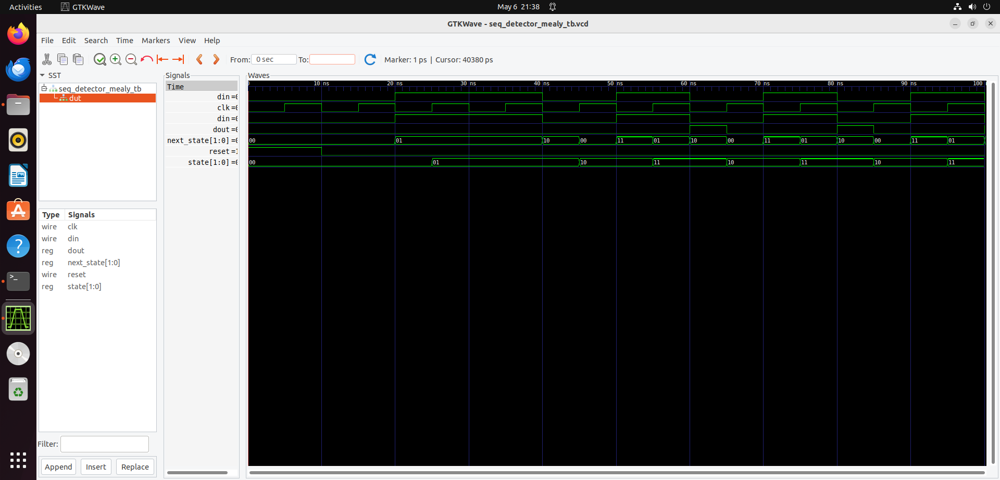
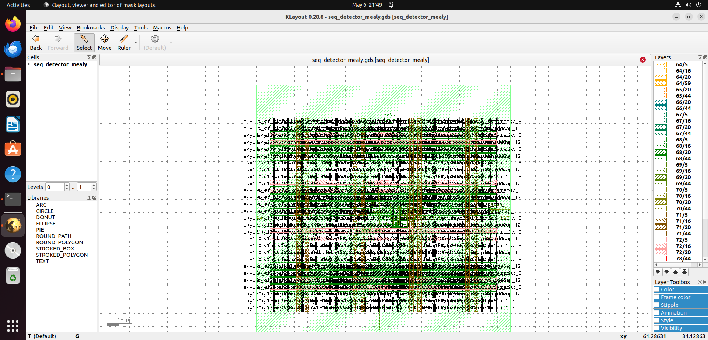

# Sequence Detector (Mealy FSM) - OpenLane Project
A Mealy FSM designed to detect the sequence "1010" using OpenLane v1.1.1 with the SkyWater 130nm PDK.

## Simulation Verification
- **Tool Used**: Icarus Verilog (`iverilog`) and GTKWave
- **Testbench**: `seq_detector_mealy_tb.v`
- **Input Sequence**: "11010101011"
- **Expected Output**: Detects "1010" at 50 ns, 70 ns, and 90 ns (`dout = 1`).
- **Result**: Verified using GTKWave, as shown below.

## Key Metrics
- Area: 6761.5 µm²
- Worst Slack: 4.39 ns
- Total Power: 0.0703 µW
- DRC: 0 violations
- LVS: Clean

## Layout

## FSM Transitions
The FSM transitions for the sequence "1010" are shown below:

